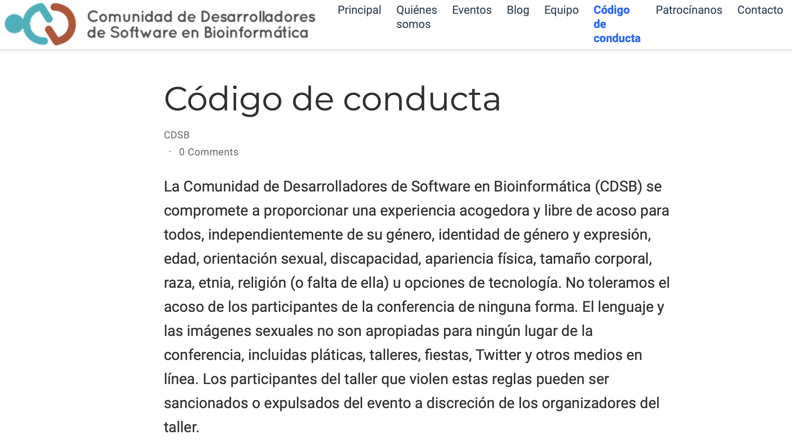
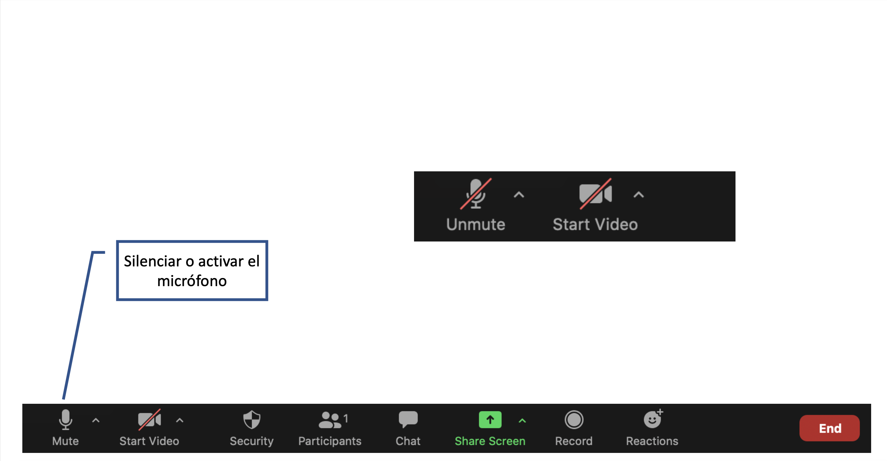
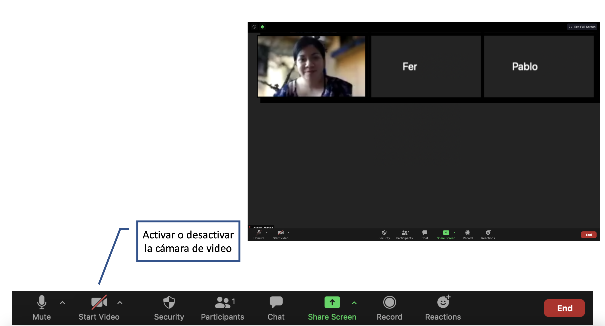
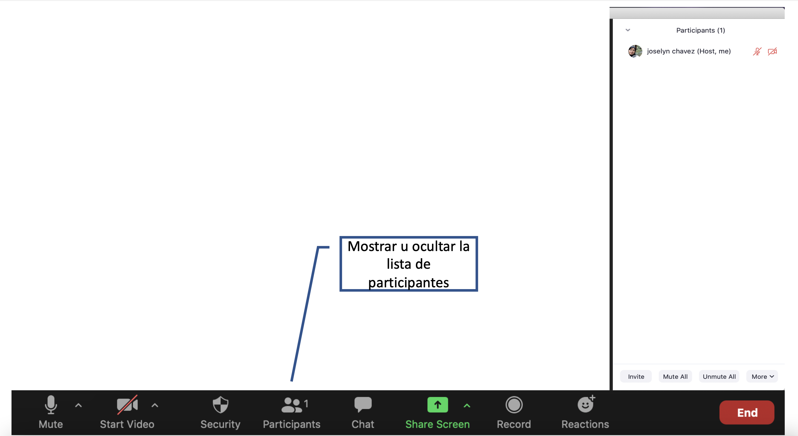
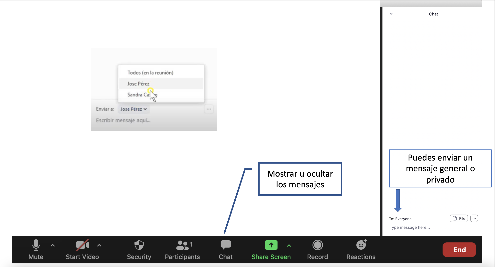
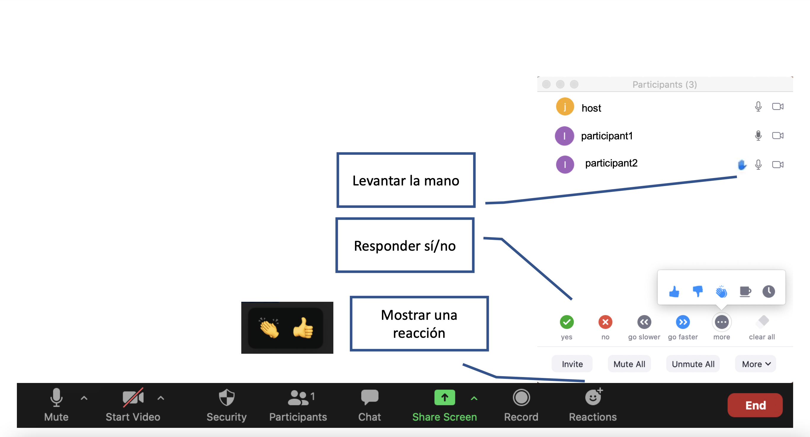

class: chapter-slide

# Código de Conducta

---

class: middle, center

```{r, echo=FALSE, out.width = "100%" }

```

[https://comunidadbioinfo.github.io/es/codigo-de-conducta/](https://comunidadbioinfo.github.io/es/codigo-de-conducta/)

---

class: middle, center

### Si necesitas reportar una ruptura al Código de Conducta escríbenos a

### **cdsbmexico@gmail.com**

---

class: chapter-slide

# Herramientas de Zoom

---

class: middle

```{r, echo=FALSE, out.width = "100%" }

```

---
class: middle
```{r, echo=FALSE, out.width = "100%" }

```

---
class: middle
```{r, echo=FALSE, out.width = "100%" }

```

---
class: middle
```{r, echo=FALSE, out.width = "100%" }

```

---
class: middle
```{r, echo=FALSE, out.width = "100%" }

```

---

class: title-slide, center, middle

# ¡Disfruten el curso!
